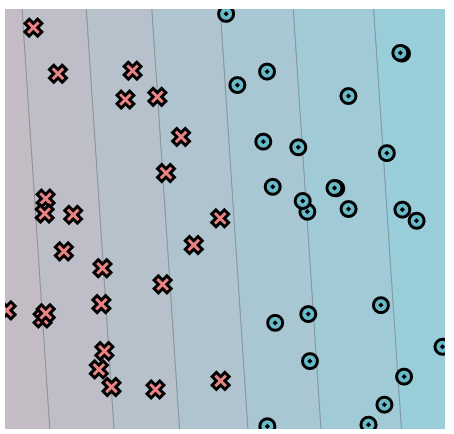

# MiniTorch Module 0


Homework for MiniTorch Module 0

Tasks
* Task 0.1: Operators
* Task 0.2: Testing and Debugging
* Task 0.3: Functional Python
* Task 0.4: Modules
* Task 0.5: Visualization


```
linear.weight_0_0 = -1.43
linear.weight_1_0 = -0.09
linear.bias_0 = 0.14
```

* Docs: https://minitorch.github.io/
* Overview: https://minitorch.github.io/module0.html