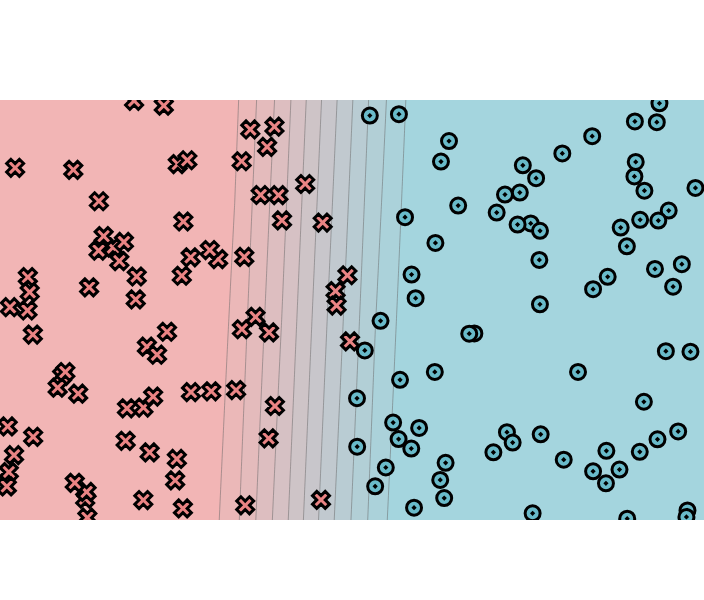

# MiniTorch Module 0

* Docs: https://minitorch.github.io/

* Overview: https://minitorch.github.io/module0/module0/

## Task 0.1: Operators

Complete the following functions in `minitorch/operators.py` and pass tests marked as `task0_1`.

 -  `mul` - Multiplies two numbers

 -  `id` - Returns the input unchanged

 -  `add` - Adds two numbers

 -  `neg` - Negates a number

 -  `lt` - Checks if one number is less than another

 -  `eq` - Checks if two numbers are equal

 -  `max` - Returns the larger of two numbers

 -  `is_close` - Checks if two numbers are close in value

 -  `sigmoid` - Calculates the sigmoid function

 -  `relu` - Applies the ReLU activation function

 -  `log` - Calculates the natural logarithm

 -  `exp` - Calculates the exponential function

 -  `inv` - Calculates the reciprocal

 -  `log_back` - Computes the derivative of log times a second arg

 -  `inv_back` - Computes the derivative of reciprocal times a second arg

 -  `relu_back` - Computes the derivative of ReLU times a second arg

## Task 0.2: Testing and Debugging 

Complete the test functions in `tests/test_operators.py` marked as `task0_2`.

## Task 0.3: Functional Python 

Complete the following functions in `minitorch/operators.py` and pass tests marked as `tasks0_3`.

 - `map` - Higher-order function that applies a given function to each element of an iterable
 - `zipWith` - Higher-order function that combines elements from two iterables using a given function
 - `reduce` - Higher-order function that reduces an iterable to a single value using a given function

Using the above functions, implement:

 - `negList` - Negate all elements in a list using map
 - `addLists` - Add corresponding elements from two lists using zipWith
 - `sum` - Sum all elements in a list using reduce
 - `prod` - Calculate the product of all elements in a list using reduce

## Task 0.4: Modules

Complete the functions in `minitorch/module.py` and pass tests marked as `tasks0_4`.

## Task 0.5: Visualization

- Add docstrings for all the different datasets required for this part.

- Start a streamlit server and print an image of the dataset. Hand-create classifiers that split the linear dataset into the correct colors.

- Add the image in the README file in your repo along with the parameters that your used.

###  Linear Dataset - Parameters and Image

#### Selected parameters:

    -   linear.weight0: -10.0
    -   linear.weight1:  0.26
    -   linear.bias:    4.04

#### Dataset Image 

